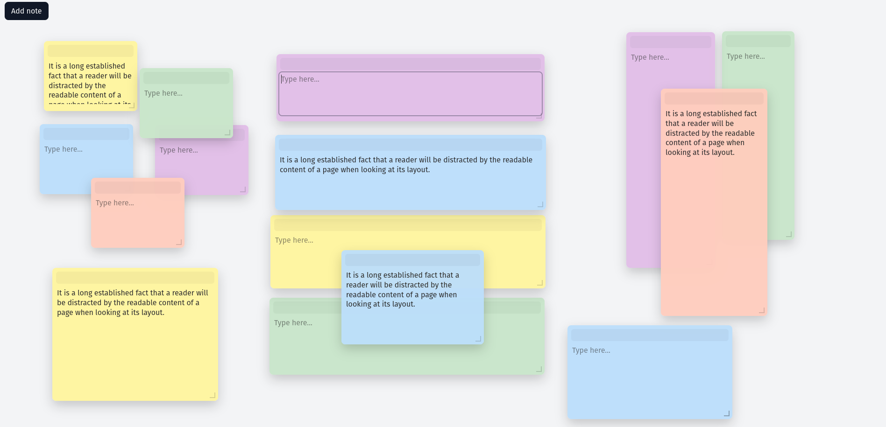

# Sticky Notes (React + TypeScript)

**A small sticky notes app built with React and TypeScript as a timed test task.**

## Preview



## Run

```bash
npm install
npm run dev
```

## Architecture

The app is split into a few simple layers to keep things predictable and easy to read.

domain/ contains the Note type and pure functions like moveNote and resizeNote. They handle all position and size updates, so this logic is not mixed into React components.

State is managed with Zustand in `store/useNotesStore.ts`. The store handles creating notes, updating them, managing z-index, and saving to localStorage.

UI is built from small components. Board is the main area, Note renders a single note, and interaction logic is extracted into hooks like `usePointer`, `useDrag`, and `useResize`.

`infrastructure/storage.ts` wraps localStorage access and keeps it isolated from the rest of the app.

## Implemented Features

Core features (3 of 4 required):

- Create a note
- Drag to move
- Drag to resize

Optional features:

- Text editing inside notes
- Bring note to front on interaction (overlap handling)
- Save and restore notes with `localStorage`

Not implemented:

- Remove note by dragging to a trash zone

## Performance

The app was tested using browser DevTools.

- Smooth drag and resize interactions (~16–24ms per frame)
- No layout shifts (CLS = 0)
- Fast initial render (LCP ~0.2s)
- Acceptable input latency (INP ~150ms)

Optimizations:

- CSS `transform` is used for positioning (GPU-friendly)
- Pointer events instead of mouse events
- State updates are based on initial pointer position (no cumulative drift)
- localStorage writes are debounced to avoid blocking the main thread

## Notes on scope

The task was limited in time, so I focused on getting the core interactions stable and keeping the code clean.

I skipped the trash zone because it adds extra complexity around hit testing and drag state, while not bringing much value compared to move and resize.
